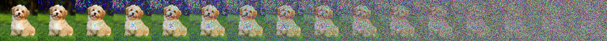
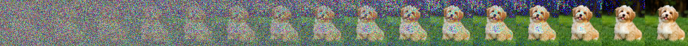
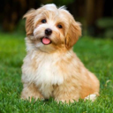
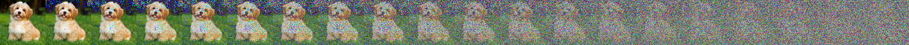

Imagine we took an image and added random noise to it; if we did this repeatedly, we would eventually end up with just noise (and no recognizable features pertaining to the original image). 



Now, what if we had a magic function that started with the noise and gradually removed the noise, eventually regenerating the coherent (original) image? This magic function is essentially the denoising diffusion model.



Two main differences to note between diffusion models and other popularly-used generative models such as GANs or VAEs is that: (1) diffusion models don't perform one-step denoising; they denoise incrementally (which can be effective, but not efficient time-wise), and (2) the latent representation has high dimensionality, i.e., same as the original data.

### Installs, imports, and setup

The code in this blog post is written in Python and requires the following imports (you need to install the imported packages if not already installed):

```python
import torch
import torchvision
import torchvision.transforms.functional as TF

from PIL import Image
import requests

import matplotlib.pyplot as plt

import math
```

Next, let's download an image to use as a toy example and proof-of-concept as we go through the ideas in diffusion models; feel free to replace the image URL (specified using `img_url`) below:

```python
img_url = "https://cdn6.bigcommerce.com/s-irxdkj2qs2/product_images/uploaded_images/new-havanese.jpg"
img = Image.open(requests.get(img_url, stream=True).raw).resize((128, 128))
img
```


---

## Introduction

### Foward process

The process of incrementally adding Gaussian noise at each timestep is referred to as the forward process and destroys information gradually, usually according to a non-learned, manually-defined variance schedule. More concretely, given a data point, $$x_0 \sim q(x)$$, where $$q(x)$$ is the "true" (unknown to us!) pdf of the data, the forward process of $$T$$ total timesteps is such that at each timestep $$t \in \{1, 2, \dotsc, T\}$$, we produce a noisy sample $$x_t$$ as follows:

$$q(x_t | x_{t-1}) = \mathcal{N}(x_t; \mu = x_{t-1}\sqrt{1-\beta_t}, \sigma^2 = \beta_t \mathrm{I})$$

where $$\beta_t \in (0, 1)$$ is the variance schedule, and usually $$\beta_1 < \beta_2 < \cdots < \beta_T$$ [= it's okay to take larger steps as the input gets noisier]; the variance schedule (as we will see later) can be linear, quadratic, cosine, etc. Given a well-behaved variance schedule, the forward process results in an <a href="https://math.stackexchange.com/a/2137851">isotropic Gaussian distribution [= variance in each dimension of the multivariate Gaussian is the same; $$\Sigma = \sigma^2\mathrm{I}$$]</a> at $$T = \infty$$. 

Simply put, the forward process is essentially drawing (slightly noisier) samples (at each timestep) from a *conditional* Gaussian with mean $$x_{t-1}\sqrt{1-\beta_t}$$ and variance $$ \beta_t \mathrm{I}$$. For some $$\varepsilon \sim \mathcal{N}(0, 1)$$, the above can also be written as (following the properties of a standard normal distribution): 

$$x_t \sim \mathcal{N}(x_{t-1}\sqrt{1-\beta_t}, \beta_t \mathrm{I}) \equiv x_t = x_{t-1} \sqrt{1-\beta_t} + \varepsilon\sqrt{\beta_t} $$

The forward process is a simple Markov chain, where the distribution at a particular timestep only depends on the sample from the immediately preceeding timestep. Hence,

$$q(x_{1:T} | x_0) = \prod_{t=1}^T q(x_t | x_{t-1})$$

A nice property of the forward process us that any $$x_t$$ can be sampled for some arbitrary timestep $$t$$ in a closed form as follows; let $$\alpha_t = 1 - \beta_t$$ and $$\bar{\alpha}_t = \prod_{s=1}^T \alpha_s$$:

$$\begin{align*}
x_t = q(x_t | x_0) = \prod_{t=1}^T q(x_t | x_{t-1}) &= \prod_{t=1}^T x_{t-1} \sqrt{\alpha_t} + \varepsilon_t\sqrt{1 - \alpha_t} \\
&= \prod_{t=2}^T \left(x_{t-2} \sqrt{\alpha_{t-1}} + \varepsilon_{t-1}\sqrt{1 - \alpha_{t-1}} \right) \sqrt{\alpha_t} + \varepsilon_t \sqrt{1 - \alpha_t} \\
&= \prod_{t=2}^T x_{t-2} \sqrt{\alpha_t\alpha_{t-1}} + {\varepsilon_{t-1} \sqrt{\alpha_t - \alpha_t\alpha_{t-1}}}_{\mathcal{N}(0, \alpha_t - \alpha_t\alpha_{t-1})} + {\varepsilon_{t} \sqrt{1 - \alpha_t}}_{\mathcal{N}(0, 1 - \alpha_t)} \\
&= \prod_{t=2}^T x_{t-2} \sqrt{\alpha_t\alpha_{t-1}} + \varepsilon \sqrt{1 - \alpha_t\alpha_{t-1}} \\
&\hphantom{=~} \vdots \\
&= x_0 \sqrt{\bar{\alpha}_t} + \varepsilon \sqrt{1 - \bar{\alpha}_t}
\end{align*}$$

Hence, $$q(x_t | x_0) = \mathcal{N}(x_t; x_0 \sqrt{\bar{\alpha}_t}, (1 - \bar{\alpha}_t) \mathrm{I})$$.

#### Implementation

From above, we note that the forward diffusion process relies on a variance schedule to incrementally add noise. In their work on Denoising Diffusion Probabilistic Models (DDPM), [Ho et al., 2020](https://arxiv.org/pdf/2006.11239.pdf) employed a linear schedule:

<blockquote><div>
"<i>We set the forward process variances to constants increasing linearly from \(\beta_1 = 10^{-4}\) to \(\beta_T = 0.02\).</i>"
</div></blockquote>





```python
def linear_beta_schedule(num_timesteps, beta_1=0.0001, beta_T=0.02):
	return torch.linspace(beta_1, beta_T, num_timesteps)
```




```python

```



Let's generate forward process samples using the linear variance schedule for a total of $$T = 100$$ timesteps, starting with $$\beta_1 = 0.0001$$ and ending at $$\beta_{100} = 0.02$$. Note that the noise is added to PyTorch tensors, as opposed to Pillow images; to go from Pillow images to PyTorch tensors, we perform the following transformations: (1) normalize images by dividing by $$255$$ so that the images are in $$[0, 1]$$ range, and (2) ensure that the images are in $$[-1, 1]$$ range following the DDPM paper:

<blockquote><div>
"<i>We assume that image data consists of integers in \(\{0, 1, ..., 255\}\) <a href="https://datascience.stackexchange.com/a/54383">scaled linearly to \([-1, 1]\)</a>. This ensures that the neural network reverse process operates on consistently scaled inputs starting from the standard normal prior \(p(x_T)\).</i>"
</div></blockquote>

```python
def populate_forward_samples(beta_scheduler=linear_beta_schedule, num_timesteps=100, beta_1=0.0001, beta_T=0.02):
	betas = beta_scheduler(num_timesteps=100)
	img_tensors = [TF.to_tensor(img) * 2 - 1]  # the original image
	for beta_t in betas:
	    img_tensor_prev = img_tensors[-1]
	    img_tensors.append((img_tensor_prev * math.sqrt(1 - beta_t)) + 
	                       (math.sqrt(beta_t) * torch.randn_like(img_tensor_prev)))
	return img_tensors

img_tensors = populate_forward_samples(beta_scheduler =linear_beta_schedule, num_timesteps=100)
```

Let's visualize the forward process noise addition using a linear variance schedule (defined in the above code block) at $$20$$ different timesteps spread evenly across the total of $$T = 100$$ timesteps [= $$t = \{0, 5, 10, \dotsc, 100\}$$]: 

```python
def plot_img_grid(img_tensors, ncols=20):
	ncols, nrows = ncols, 1
	width, height = img.size
	grid = Image.new('RGB', size=(ncols * width, nrows * height))
	for idx in range(0, len(img_tensors), len(img_tensors) // ncols):
	    _img = TF.to_pil_image((img_tensors[idx] + 1) / 2)
	    idx = int(idx / (len(img_tensors) // ncols))
	    grid.paste(_img, box=((idx % ncols) * width, (idx // ncols) * height))
	return grid

plot_img_grid(img_tensors, ncols=20)
```


### Parameterized reverse process

If we can somehow reverse the above process

### An aside on variance scheduling

In the forward process, the final limiting distribution is essentially $$q(x_T | x_0) \sim \mathcal{N}(0, \mathrm{I})$$.