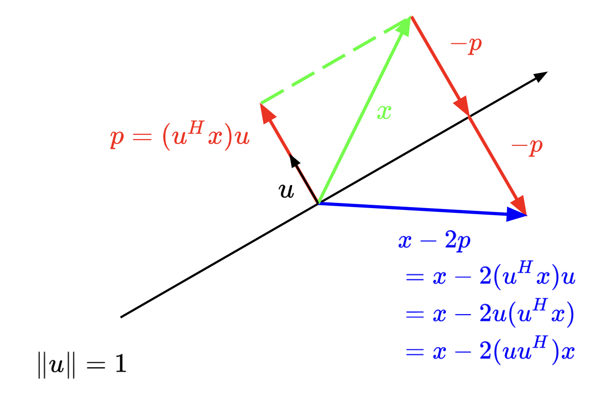
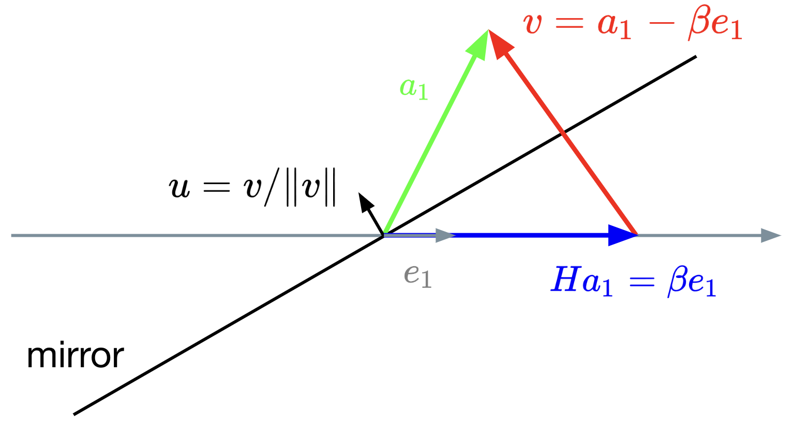
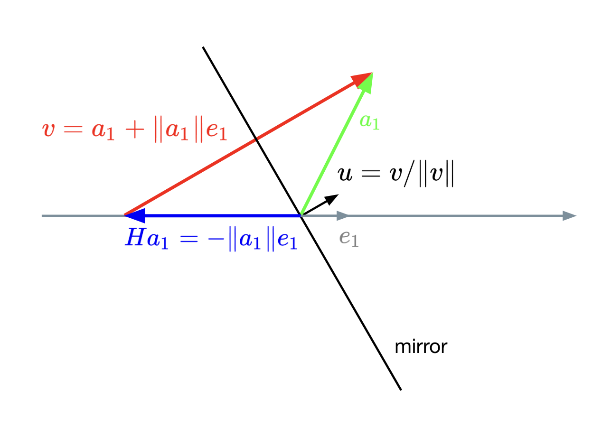
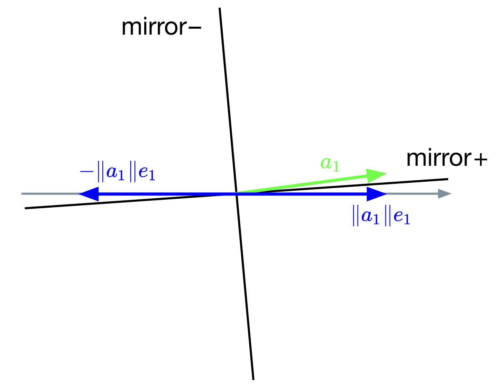

{:toc}

---

A compelling motivation: A natural decomposition for thinking about least 
squares problems ($Ax = b$) is the QR decomposition of $A$,

$$
A = QR,
$$

where $Q$ is an $m \times m$ unitary matrix (recall: $Q^H Q = \mathrm{I}$ for
unitary $Q$) and $R$ is an $m \times n$ upper triangular matrix. For 
tall-thin matrices ($m \geq n$), it is often beneficial to note the _economy_ 
(or, thin [Golub and Van Loan], or, reduced [Trefethen and Bau]) QR 
decomposition as

$$
A = QR = Q \begin{bmatrix}
R_1 \\
0
\end{bmatrix} = \begin{bmatrix} Q_1 & Q_2 \end{bmatrix} \begin{bmatrix}
R_1 \\
0
\end{bmatrix} = Q_1 R_1,
$$

where $R_1$ is an $n \times n$ upper triangular matrix and $0$ is an 
$(m - n) \times n$ zero matrix, $Q_1$ is an $m \times n$ matrix, and $Q_2$ is
$m \times (m - n)$. ($Q_1$ and $Q_2$ have orthogonal columns.)

We can find a solution, $\hat{x}$, to an overdetermined system $Ax = b$ 
($m \geq n$) using the QR decomposition as

$$
\hat{x} = R_1^{-1} (Q_1^H b).
$$

(Note: We don't need to explicitly compute $R_1^{-1}$; instead, we can use
back substitution to find $\hat{x}$.)

---

#### Gram-Schmidt, a brief note

A first course in linear algebra often shows orthogonalization (converting the 
existing basis of $A$ to an orthonormal basis) using the Gram-Schmidt process.
The Gram-Schmidt process orthogonalizes by subtracting off components in the
directions of previous columns and then normalizing the remainder to unit 
length. Simply put,

$$
q_j = (\mathrm{I} - P_{j-1}) a_j,
$$

where $P_{j-1}$ is a projector onto $(q_1, \dotsc, q_{j-1})$.

A critical question to ask here is the following: what happens when $a_j$ is
large and lies really close to $P_{j-1}$—aha!—the computation of $q_j$ as shown
above is prone to catastrophic cancellation. More concretely, the computed $q_j$
might not be orthogonal to previous $q_j$s.

To overcome this issue of catastrophic cancellation, the _modified_ Gram-Schmidt
algorithm is often discussed. However, we will see a different approach of using
Householder reflectors to achieve orthogonal triangularizations.

---

#### QR factorization via Householder reflections

##### Reflecting a vector

Before proceeding with Householder QR, let us look at Householder reflections,
which are to become an essential part of Householder QR. 

Our goal here will be to come up with a linear transformation that reflects a 
given vector, $x$, about a subspace, $\mathcal{V}$. Let $u$ be a vector of unit
length ($\Vert u \Vert_2 = 1$) orthogonal to subspace $\mathcal{V}$. Then, 
$H = (\mathrm{I} - 2 u u^H)$ is the transformation that represents reflecting
$x$ with respect to the subspace orthogonal to the vector $u$ (= "mirror").

<div align="center">
    
</div>

$H$ is often referred to as the Householder transformation or Householder 
reflector.

Some observations to note:
* Any vector $z$ in the subspace $\mathcal{V}$ (= orthogonal to the vector $u$) 
is left unchanged: 

    $$
    Hz = (\mathrm{I} - 2 u u^H) z = z - 2 u (u^H z) = z.
    $$

* Any vector $x$ can be written as $z + (u^H x) u$, where $z$ is the projection
of $x$ onto the subspace $\mathcal{V}$ and $(u^H x) u$ is the projection in the
direction of $u$ (orthogonal to $\mathcal{V}$). Now, the reflection is

    $$
    \begin{align*}
    Hx &= (\mathrm{I} - 2 u u^H)(z + (u^H x) u) \\
    &= z + (u^H x) u - 2 u u^H (u^H x) u \\
    &= z + (u^H x) u - 2 (u^H x) u (\underbrace{u^H u}_{=\,1}) \\
    &= z + (u^H x) u - 2 (u^H x) u \\
    &= z - (u^H x) u.
    \end{align*}
    $$

    If the vector $x$ has a component orthogonal to the mirror ($u^H x \neq 0$), 
then that component is reversed.

* Finally, observe that reflection is a length-preserving transformation. (Note: 
$H^HH = HH^H = I$ and $HH = I$: reflecting a reflection results in the original
vector.)

$$
\Vert Hx \Vert_2^2 = (Hx)^H Hx = x^H (\underbrace{H^H H}_{\mathrm{I}}) x = x^H x 
= \Vert x \Vert_2^2.
$$

##### Adjusting the mirror

Given two vectors, $x$ and $y$, our goal is to find a mirror (= subspace 
$\mathcal{V}$) that facilitates reflecting vector $x$ into vector $y$ with 
$\Vert x \Vert_2 = \Vert y \Vert_2$. Simply put, we need to compute $u$ such
that

$$
\begin{align*}
y = (\mathrm{I} - 2 u u^H) x = x - 2 u u^H x
\implies 2 \underbrace{u u^H x}_{=\,p} = x - y,
\end{align*}
$$

where $p$ is the projection of $x$ onto $u$ (see figure in the previous 
subsection). By construction, $p$ and $u$ must point in the same direction.
Hence, $u$ must be a unit vector in that direction:

$$
u = \frac{x - y}{\Vert x - y \Vert_2}.
$$

Now, we have an approach of determining the vector $u$, which defines a subspace
that mirrors $x$ into $y$.

<u><i>Remark on normalization</i></u>. If $u$ is not a unit 
vector, the Householder transformation is 

$$
H = \mathrm{I} - 2 \frac{u}{\Vert u \Vert_2} \frac{u^H}{\Vert u \Vert_2} 
= \mathrm{I} - 2 \frac{u u^H}{u^H u}.
$$

##### Householder vector

Our goal is to convert $A$ to an upper triangular matrix through a series of 
orthogonal transformations. Here's a chalkboard animation (as David Bindel would
call it!):

$$
A = \begin{bmatrix} 
    \small{\times} & \small{\times} & \small{\times} \\
    \small{\times} & \small{\times} & \small{\times} \\
    \small{\times} & \small{\times} & \small{\times} \\
    \small{\times} & \small{\times} & \small{\times} \\
    \vdots & \vdots & \vdots \\
    \small{\times} & \small{\times} & \small{\times} \\
\end{bmatrix} \xrightarrow{H_1} \matrix{\begin{bmatrix} 
    \color{red}{*} & \small{*} & \small{*} \\
    \color{red}{0} & \small{*} & \small{*} \\
    \color{red}{0} & \small{*} & \small{*} \\
    \color{red}{0} & \small{*} & \small{*} \\
    \color{red}{\vdots} & \vdots & \vdots \\
    \color{red}{0} & \small{*} & \small{*} \\
\end{bmatrix} \\[1pt] \small{H_1 A}} \xrightarrow{H_2} \matrix{\begin{bmatrix} 
    * & * & * \\
    0 & \color{red}{\star} & \small{\star} \\
    0 & \color{red}{0} & \small{\star} \\
    0 & \color{red}{0} & \small{\star} \\
    \vdots & \color{red}{\vdots} & \vdots \\
    0 & \color{red}{0} & \small{\star} \\
\end{bmatrix} \\[1pt] \small{ H_2 H_1 A}} \xrightarrow{H_3} \matrix{\begin{bmatrix} 
    * & * & * \\
    0 & \star & \star \\
    0 & 0 & \color{red}{\small{\bullet}} \\
    0 & 0 & \color{red}{0} \\
    \vdots & \vdots & \color{red}{\vdots} \\
    0 & 0 & \color{red}{0} \\
\end{bmatrix} \\[1pt] \small{ H_3 H_2 H_1 A}} = \begin{bmatrix}
R_1 \\
0
\end{bmatrix}
$$

Let us look at the first step $H_1A$:

$$
H_1 A = H_1 \begin{bmatrix}
| & | & & | \\
a_1 & a_2 & \dots & a_n \\
| & | & & | \\
\end{bmatrix} = \begin{bmatrix}
| & | & & | \\
H_1 a_1 & H_1 a_2 & \dots & H_1 a_n \\
| & | & & | \\
\end{bmatrix},
$$

where $a_j$ is an $m$-dimensional column of $A$. What we essentially require is 
a Householder transformation such that $H_1 a_1 = \beta e_1$ for some constant
$\beta$, $e_1$ is the first standard basis vector. Since Householder reflectors
preserve lengths, we need $\vert \beta \vert = \Vert a_1 \Vert_2$. Hence, we 
need to find a reflector (= mirror) $H$ that reflects $a_1$ onto the $x$-axis:

<div align="center">
    
</div>

Now, we have $v$ as

$$
v = \begin{bmatrix} 
a_{11} \\
a_{21} \\
\vdots \\
a_{m1} \\
\end{bmatrix} - \begin{bmatrix} 
\beta \\
0 \\
\vdots \\
0 \\
\end{bmatrix}.
$$

Notice that we have several options to choose $\beta$: $\Vert a_1 \Vert_2$,
$- \Vert a_1 \Vert_2$, $z \Vert a_1 \Vert_2$ for some $z \in \mathbb{C}$ with 
$\vert z \vert = 1$. If we restrict to real-valued $a_1$, we have

$$
v = a_1 \mp \Vert a_1 \Vert_2 e_1.
$$

If we choose $\beta = -\Vert a_1 \Vert_2$, we are consequently placing the 
mirror as follows:

<div align="center">
    
</div>

For completeness, we have 

$$
H_1 a_1 = 
    \left(\mathrm{I} - 2 \frac{vv^H}{\Vert v \Vert^2_2}\right) a_1 = \beta e_1.
$$

<u><i>Remark on numerical stability</i></u>. Observe that the first element of 
$v$, $v_1 = a_{11} \mp \Vert a_1 \Vert_2$. If $a_{11}$ is positive and 
$a_{11} \approx \Vert a_1 \Vert_2$ ($a_1$ is really close to $x$-axis), we incur
catastrophic cancellation in the computation of $a_{11} - \Vert a_1 \Vert_2$.

<div align="center">
    
</div>

Irrespective of the sign of $a_{11}$, we can avoid catastrophic cancellation by 
choosing $v = a_1 + \text{sign}(a_{11}) \Vert a_1 \Vert_2 e_1$:

$$
v = \begin{bmatrix} 
a_{11} + \text{sign}(a_{11}) \Vert a_1 \Vert_2 \\
a_{21} \\
\vdots \\
a_{m1} \\
\end{bmatrix}.
$$

<u><i>Remark on storing Householder vectors</i></u>. A simple observation from 
$H_1 a_1 = \beta e_1$ is that the entries other than the first entry of 
$H_1 a_1$ are zeros, meaning $(v_2, \dotsc, v_m)$ can be stored as entries of
$(H_1 a_1)[2:]$. Additionally, if we can scale $v$ in a way that ensures 
$v_1 = 1$, we don't need to explicitly store $v_1$. Hence

$$
\tilde{v} = \frac{v}{v_1} = 
\frac{1}{a_{11} + \text{sign}(a_{11}) \Vert a_1 \Vert_2} \begin{bmatrix} 
1 \\
a_{21} \\
\vdots \\
a_{m1} \\
\end{bmatrix}.
$$

(If $v_1 = 0$, we can simply set $\tilde{v}_{j > 1} = 0$.)

```python
from copy import deepcopy

import jaxtyping as jt
import torch

Fl = lambda size: jt.Float[torch.Tensor, size]

sign = lambda x: x and (1, -1)[x < 0]
fl64_randn = lambda size: torch.randn(size, dtype=torch.float64)
fl64_zeros = lambda size: torch.zeros(size, dtype=torch.float64)


def housev_(a1: Fl("m")):
    """
    Apply Householder transformation to vector `a1` and store the associated
    Householder vector in `a1`.

    Note: By convention, `v1 = 1` and `v[2:]` are stored in `a1[2:]`. Also 
    notice zero-indexing in code, while function definitions and variable 
    names employ one-indexing.

    (Convention: Keeping in line with PyTorch convention `_` at the end of a 
    function name indicates an inplace operation.)
    """
    a11 = a1[0]
    rho11 = -sign(a11) * torch.norm(a1)  # stable choice
    v1 = a11 - rho11
    a1[0] = rho11  # R11 (in A = QR)
    a1[1:] /= v1  # inplace op; stores a1[1:] = v[1:], v[0] = 1.0


m = 10
a1 = fl64_randn(m)  # random from N(0, 1)
a1_ref = deepcopy(a1)  # store to check correctness of H1

housev_(a1)  # stores v in a1
v_H1 = torch.cat((torch.tensor(1.0)[None], a1[1:]))
print(f"ṽ={v_H1}")
print(f"R11={a1[0]}")

H1 = torch.eye(m, m) - 2 * torch.outer(v_H1, v_H1) / torch.norm(v_H1)**2
H1_a1 = H1 @ a1_ref
print(f"H1@a1={H1_a1}")
assert torch.allclose(H1_a1[1:], fl64_zeros(m - 1))
assert torch.allclose(H1_a1[0], a1[0])
```

##### Householder QR

Now, let us see how to achieve the complete QR transformation (as shown in the
chalkboard animation) through a sequence of Householder transformations. In the
first iteration, we can block-partition $A$ as:

$$
A = \begin{bmatrix}
\alpha_{11} & a_{12}^T \\
a_{21} & A_{22} \\ 
\end{bmatrix}.
$$

Let the Householder transformation computed from the first column be as follows:

$$
\text{housev}\left(\begin{bmatrix}\alpha_{11} \\ a_{21} \end{bmatrix}\right) = 
\begin{bmatrix}
\rho_{11} \\
\tilde{v}_{21} \\ 
\end{bmatrix},
$$

where $\rho_{11} = \beta = -\text{sign}(\alpha_{11}) \Vert A[:,1] \Vert_2$.

Now, applying unblocked Householder transformation to $A$ results in

$$
\text{hqr}(A) =  
\left(\mathrm{I} - \frac{2}{1 + \Vert \tilde{v}_{21} \Vert_2^2} 
\begin{bmatrix}1 \\ \tilde{v}_{21}\end{bmatrix} 
\begin{bmatrix}1 \\ \tilde{v}_{21}\end{bmatrix}^T\right) 
\begin{bmatrix}
\alpha_{11} & a_{12}^T \\
a_{21} & A_{22} \\ 
\end{bmatrix} = \begin{bmatrix}
\rho_{11} & \color{red}{\small{\times}} \\
0 & \color{red}{\small{\times}} \\ 
\end{bmatrix}
$$

Note that the second column above is the resultant of

$$
\left(\underbrace{\mathrm{I} - \frac{2}{1 + \Vert \tilde{v}_{21} \Vert_2^2} 
\begin{bmatrix}1 \\ \tilde{v}_{21}\end{bmatrix} 
\begin{bmatrix}1 \\ \tilde{v}_{21}\end{bmatrix}^T}_{H_1}\right) \begin{bmatrix}
a_{12}^T \\ 
A_{22} \\ 
\end{bmatrix}.
$$

If we explicitly form $H_1$, we would incur $\mathcal{O}(n^2)$ computations and
applying the matrix is  $\mathcal{O}(n^3)$. So instead, we will compute it as
follows:

$$
\begin{bmatrix}
a_{12}^T \\ 
A_{22} \\ 
\end{bmatrix} - 
\begin{bmatrix}1 \\ \tilde{v}_{21}\end{bmatrix}
\underbrace{\frac{2}{1 + \Vert \tilde{v}_{21} \Vert_2^2} 
\underbrace{\begin{bmatrix}1 & \tilde{v}_{21}^T \end{bmatrix} \begin{bmatrix}
a_{12}^T \\ 
A_{22} \\ 
\end{bmatrix}}_{=\,a_{12}^T + \tilde{v}_{21}^T A_{22}}}_{w_{12}^T}.
$$

Now, we have

$$
\text{hqr}(A) =  
\left(\mathrm{I} - \frac{2}{1 + \Vert \tilde{v}_{21} \Vert_2^2} 
\begin{bmatrix}1 \\ \tilde{v}_{21}\end{bmatrix} 
\begin{bmatrix}1 \\ \tilde{v}_{21}\end{bmatrix}^T\right) 
\begin{bmatrix}
\alpha_{11} & a_{12}^T \\
a_{21} & A_{22} \\ 
\end{bmatrix} = \begin{bmatrix}
\rho_{11} & \color{red}{\small{\times}} \\
0 & \color{red}{\small{\times}} \\ 
\end{bmatrix} = \begin{bmatrix}
\rho_{11} & a_{12}^T - w_{12}^T \\
0 & A_{22} - \tilde{v}_{21} w_{12}^T \\ 
\end{bmatrix}.
$$

Note that in this formulation involves computing $w_{12}^T$ (involving 
matrix-vector multiplication) and the updated $A_{22}$ (a rank-one update). This
is cheaper than forming $H_1$ and performing matrix-matrix multiplication. (We 
will explicitly analyze the computational cost once we write down the complete
algorithm.)

In the next iteration, we proceed with by running Householder transformation on
the first column of the updated $A_{22}$. Note that the associated $H_2$ applied
to the entire matrix (which ignores first row and column of $A$) is

$$
H_2 = \begin{bmatrix}
\mathrm{I} & 0 \\
0 & \mathrm{I} - \dfrac{2}{1 + \Vert \tilde{v}_{21} \Vert_2^2} 
\begin{bmatrix}1 \\ \tilde{v}_{21}\end{bmatrix} 
\begin{bmatrix}1 \\ \tilde{v}_{21}\end{bmatrix}^T
\end{bmatrix}.
$$

```python
import numpy as np


def housev_(A22: Fl("m n")):
    """Apply Householder transformation to the first column of A22."""
    alpha11 = A22[0, 0]
    a21 = A22[1:, 0]
    rho11 = -sign(alpha11) * torch.norm(A22[:, 0])
    v1 = alpha11 - rho11
    A22[0, 0] = rho11
    a21 /= v1


def hqr_(A: Fl("m n")):
    """
    Transform `A` to upper triangular using Householder QR.

    Note: The elements below the diagonal store the vectors associated with
    the respective Householder transformation.
    """
    A22 = A
    while A22.shape[1] > 0:
        # A22: (m - k + 1, n - k + 1) at iter k = {1, ..., n}.
        housev_(A22)

        a12_tr = A22[0, 1:][None]  # (1, n - k)
        a21 = A22[1:, 0][:, None]  # (m - k, 1)
        A22 = A22[1:, 1:]  # (m - k, n - k)

        # w12_tr: (1, n - k)
        w12_tr = (2 / (1 + torch.norm(a21) ** 2)) * (a12_tr + a21.T @ A22)
        a12_tr -= w12_tr
        A22 -= a21 @ w12_tr


# Compare with standard numpy implementation: `np.linalg.qr`.
m, n = 5, 3
A = fl64_randn([m, n])
A_ref = deepcopy(A)
hqr_(A)

R_np = np.linalg.qr(A_ref, "reduced").R
assert torch.allclose(torch.triu(A)[:n], torch.from_numpy(R_np))
```

<u><i>Remark on computational complexity</i></u>. For the above algorithm, bulk 
of the computation goes in computing $w_{12}^T$ and updating $A_{22}$. Computing 
$a_{21}^T A_{22}$ and $a_{21} w_{12}^T$ cost $\mathcal{O}((m - k)(n - k))$. 
Since $k$ runs through all the columns of $A$, the cost is approximately 
$\sum_{k=1}^{n} ((m - k)(n - k))$—simplifying this gives us the cost of the 
algorithm to be $\mathcal{O}(mn^2)$. 

##### Forming $\boldsymbol{Q}$

Running a full iteration of Householder QR on an $m \times n$ matrix $A$ results 
in

$$
H_n \dots H_2 H_1 A = R,
$$

where $R$ is upper trapezoidal and $H_j$ is a unitary Householder transformation
(almost: note that the top-left corner is a $j-1 \times j-1$ identity matrix).
Further, we know that $H_j^{-1} = H_j$. Hence, we have

$$
A = \underbrace{H_1 H_2 \dots H_n}_{Q} R.
$$

Note that the above algorithm doesn't explicitly form  $Q^T = H_n \dots H_1$ 
(or, $Q = H_1 \dots H_n$), and as long as we have efficient routines to perform 
BLAS operations using the Householder vectors, we won't need to explicitly form 
$Q$ or $Q^T$. However, in few specific cases we may need to explicitly form 
$Q$ (e.g., for forward error analysis), and we'll now see how to do so.

Observe that if we now apply our Householder transformations on to the (padded)
identity matrix in reverse, we have

$$
H_1 H_2 \dots H_n 
\begin{bmatrix} 
    \mathrm{I}_{n \times n} \\
    0_{m - n \times n} 
\end{bmatrix} = Q.
$$

Let us consider the first step of applying $H_n$. Note that for an $m \times n$
matrix $A$, $H_n$ only modifies $A[n:, n:]$ entries. As an example, consider a
$5 \times 3$ $A$ and let's see how $H_3$ applies:

$$
\begin{align*}
H_3 
\begin{bmatrix} 
    \mathrm{I}_{3 \times 3} \\ 
    0_{2 \times 3} 
\end{bmatrix} 
&=
\begin{bmatrix}
    \mathrm{I}_{2 \times 2} & 0 \\
    0 & \mathrm{I} - \dfrac{2}{1 + \Vert \tilde{v}_{21} \Vert_2^2} 
            \begin{bmatrix}1 \\ \tilde{v}_{21}\end{bmatrix} 
            \begin{bmatrix}1 \\ \tilde{v}_{21}\end{bmatrix}^T
\end{bmatrix} \begin{bmatrix}
    1 & 0 & 0 \\
    0 & 1 & 0 \\
    0 & 0 & \color{red}{1} \\
    0 & 0 & \color{red}{0} \\
    0 & 0 & \color{red}{0} \\
\end{bmatrix} \\
&= 
\left(
    \mathrm{I} - \frac{2}{1 + \Vert \tilde{v}_{21} \Vert_2^2} 
    \begin{bmatrix}1 \\ \tilde{v}_{21}\end{bmatrix} 
    \begin{bmatrix}1 \\ \tilde{v}_{21}\end{bmatrix}^T
\right)
\begin{bmatrix} 
    1 \\
    0_{2 \times 1}
\end{bmatrix} \\
&=
\begin{bmatrix} 
    1 \\
    0_{2 \times 1}
\end{bmatrix} - \frac{2}{1 + \Vert \tilde{v}_{21} \Vert_2^2} 
\begin{bmatrix}1 \\ \tilde{v}_{21}\end{bmatrix} 
\left(
    \begin{bmatrix}1 & \tilde{v}_{21}^T\end{bmatrix}
    \begin{bmatrix} 
        1 \\
        0_{2 \times 1}
    \end{bmatrix}
\right) \\
&=
\begin{bmatrix} 
    1 - \dfrac{2}{1 + \Vert \tilde{v}_{21} \Vert_2^2} \\
    -\tilde{v}_{21} \dfrac{2}{1 + \Vert \tilde{v}_{21} \Vert_2^2} 
\end{bmatrix}.
\end{align*}
$$

Next, let's apply $H_2$:

$$
\begin{align*}
H_2 \begin{bmatrix}
    1 & 0 & 0 \\
    0 & \color{red}{1} & \color{red}{0} \\
    0 & \color{red}{0} & \color{red}{\small{\times}} \\
    0 & \color{red}{0} & \color{red}{\small{\times}} \\
    0 & \color{red}{0} & \color{red}{\small{\times}}  \\
\end{bmatrix}
&=
\left(
    \mathrm{I} - \frac{2}{1 + \Vert \tilde{v}_{21} \Vert_2^2} 
    \begin{bmatrix}1 \\ \tilde{v}_{21}\end{bmatrix} 
    \begin{bmatrix}1 \\ \tilde{v}_{21}\end{bmatrix}^T
\right) \begin{bmatrix}
    1 & 0 \\
    0_{3 \times 1} & A_{22} \\
\end{bmatrix} \\
&=
\begin{bmatrix}
    1 & 0 \\
    0_{3 \times 1} & A_{22} \\
\end{bmatrix} - \frac{2}{1 + \Vert \tilde{v}_{21}\Vert_2^2}
\begin{bmatrix}1 \\ \tilde{v}_{21}\end{bmatrix} 
\left(
    \begin{bmatrix}1 & \tilde{v}_{21}^T\end{bmatrix}
    \begin{bmatrix}
        1 & 0 \\
        0_{3 \times 1} & A_{22} \\
    \end{bmatrix}
\right) \\
&=
\begin{bmatrix}
    1 & 0 \\
    0_{3 \times 1} & A_{22} \\
\end{bmatrix} - \frac{2}{1 + \Vert \tilde{v}_{21}\Vert_2^2} 
\begin{bmatrix}
    1 & \tilde{v}_{21}^T A_{22} \\ 
    \tilde{v}_{21} & \tilde{v}_{21} \tilde{v}_{21}^T A_{22} \\
\end{bmatrix} \\
&= \begin{bmatrix}
    1 - \dfrac{2}{1 + \Vert \tilde{v}_{21} \Vert_2^2} & 
        -\color{green}{
            \tilde{v}_{21}^T A_{22} \dfrac{2}{1 + \Vert \tilde{v}_{21} \Vert_2^2}
        } \\
    -\tilde{v}_{21} \dfrac{2}{1 + \Vert \tilde{v}_{21} \Vert_2^2} &
        A_{22} - 
            \tilde{v}_{21} 
            \color{green}{
                \tilde{v}_{21}^T A_{22} 
                \dfrac{2}{1 + \Vert \tilde{v}_{21} \Vert_2^2}
            } \\
\end{bmatrix}.
\end{align*}
$$

Hence, we can proceed by updating a block of $A$ (inplace) as

$$
\begin{align*}
Q\left(\begin{bmatrix}
    \alpha_{11} & a_{12}^T \\
    a_{21} = \tilde{v}_{21} & A_{22}
\end{bmatrix}\right):
\\
    \alpha_{11} &\leftarrow 
        1 - \frac{2}{1 + \Vert \tilde{v}_{21} \Vert_2^2}, \\
    a_{12}^T &\leftarrow
        -a_{21}^T A_{22} \frac{2}{1 + \Vert \tilde{v}_{21} \Vert_2^2}, \\
    A_{22} &\leftarrow A_{22} + a_{21} a_{12}^T, \\
    a_{21} &\leftarrow -a_{21} \frac{2}{1 + \Vert \tilde{v}_{21} \Vert_2^2}. \\
\end{align*}
$$

```python
def Q_(A: Fl("m n")):
    """Forms `Q` from Householder vectors stored below the diagonal in `A`."""
    m, n = A.shape
    for k in range(n - 1, -1, -1):
        if k + 1 >= m:
            continue

        a21 = A[k + 1 :, k][:, None]  # (m - k - 1, 1)
        tau = 2 / (1 + torch.norm(a21) ** 2)

        A[k, k] = 1 - tau  # alpha_11
        if k + 1 < n:
            A22 = A[k + 1 :, k + 1 :]  # (m - k - 1, n - k - 1)
            a12_tr = tau * (-a21.T @ A22)
            A22 += a21 @ a12_tr  # inplace
            A[k, k + 1 :][None] = a12_tr  # write inplace
        a21 *= -tau


# Compare with standard numpy implementation: `np.linalg.qr`.
m, n = 5, 3
A = fl64_randn([m, n])
A_ref = deepcopy(A)
hqr_(A)
Q_(A)

Q_np = np.linalg.qr(A_ref, "reduced").Q
assert torch.allclose(A, torch.from_numpy(Q_np))

# Also verify that Q.T@Q is identity (orthogonality check).
assert torch.allclose(torch.eye(n, dtype=torch.float64), A.T @ A)
```

---

#### Visualizing HQR (optional reading)

This blog post was heavily inspired by me wanting to recreate the [animation 
from Gabriel Peyré's tweet (or, "x"?) on unitary triangulation of a nonsymmetric
matrix](https://x.com/gabrielpeyre/status/1788071332833354163) and partly from
wanting David Bindel's chalkboard animation to come alive!

For the purposes of this animation, we will be using a terribly inefficient way
of forming $Q$. Observe that our approach of forming $Q$ in reverse requires us
to have completed a (forward) run of the Householder QR; however, for the 
purpose of this animation, we want to show gradual change in $Q$ (as $R$ 
changes). To that end, we will update $Q$ at every iteration as

$$
Q_j = Q_{j-1} H_j.
$$

```python
def housev(A22: Fl("m n")) -> [float, float]:
    """Out-of-place Householder transformation to the first column of A22."""
    alpha11 = A22[0, 0]
    a21 = A22[1:, 0]
    rho11 = -sign(alpha11) * torch.norm(A22[:, 0])
    v1 = alpha11 - rho11
    return rho11, v1


def hqr(A: Fl("m n")) -> [Fl("m n"), Fl("n n")]:
    """Out-of-place Householder QR (forms Q explicitly)."""
    m, n = A.shape
    Q = torch.eye(m, dtype=A.dtype)
    R = deepcopy(A)

    R22 = R
    for k in range(n):
        rho11, v1 = housev(R22)
        v21 = R22[1:, 0] / v1
        R22[0, 0] = rho11
        R22[1:, 0] = torch.zeros_like(R22[1:, 0])

        v = torch.cat((torch.tensor([1.0]), v21))[:, None]
        H = torch.eye(m, dtype=A.dtype)
        H[k:, k:] -= 2 * (v @ v.T) / (v.T @ v)
        Q = Q @ H

        v21 = v21[:, None]
        r12_tr = R22[0, 1:][None]
        R22 = R22[1:, 1:]

        w12_tr = (2 / (1 + torch.norm(v21) ** 2)) * (r12_tr + v21.T @ R22)
        r12_tr -= w12_tr
        R22 -= v21 @ w12_tr

    return Q[:, :n], R[:n]


# Compare with standard numpy implementation: `np.linalg.qr`.
m, n = 5, 3
A = fl64_randn([m, n])
Q, R = hqr(A)

QR_np = np.linalg.qr(A, "reduced")
assert torch.allclose(Q, torch.from_numpy(QR_np.Q))
assert torch.allclose(R, torch.from_numpy(QR_np.R))
```

Now, let's finally animate Householder QR:

```python
from functools import partial

import matplotlib.cm as cm
import matplotlib.colors as colors
import matplotlib.pyplot as plt
import seaborn as sns
from celluloid import Camera

plt.rcParams.update({"font.size": 14})
plt.rc("text", usetex=True)
plt.rc("text.latex", preamble=r"\usepackage{amsmath} \usepackage{amssymb}")


def plt_mat(
    A: Fl("m n"),
    ax: plt.Axes,
    cmap: colors.LinearSegmentedColormap,
    norm: colors.TwoSlopeNorm,
    label: str = None,
):
    """Plot matrix `A` on the given axis `ax`."""
    A_hmap = sns.heatmap(
        A,
        ax=ax,
        cmap=cmap,
        norm=norm,
        xticklabels=[],
        yticklabels=[],
        cbar=False,
        square=(A.shape[0] == A.shape[1]),
    )
    A_hmap.axhline(y=0, color="k")
    A_hmap.axhline(y=A.shape[1], color="k")
    A_hmap.axvline(x=0, color="k")
    A_hmap.axvline(x=A.shape[0], color="k")
    if label is not None:
        ax.text(A.shape[0] / 2, A.shape[1] + A.shape[1] / 10, label)


def hqr_anim(A: Fl("m n")):
    """Animate Householder QR."""
    # Setup fig, axes for animation.
    gridspec = dict(wspace=0, width_ratios=[1.2, 1, 1])
    fig, axs = plt.subplots(
        nrows=1, ncols=3, figsize=(12, 4), gridspec_kw=gridspec
    )
    camera = Camera(fig)

    # Setup cmap and normalization to ensure 0.0 is always mapped to white.
    norm = colors.TwoSlopeNorm(vmin=-1, vcenter=0, vmax=1)
    cmap = cm.RdBu
    _plt_mat = partial(plt_mat, cmap=cmap, norm=norm)

    m, n = A.shape
    Q = torch.eye(m, dtype=A.dtype)
    R = deepcopy(A)

    # Plot `A`, add "=", as in "A = " part.
    _plt_mat(A, ax=axs[0], label=r"$\boldsymbol{A}$")
    equals_pos = (A.shape[0] + A.shape[0] / 12, (A.shape[1] + A.shape[1] / 10) / 2)
    axs[0].text(equals_pos[0], equals_pos[1], r"$\boldsymbol{=}$")
    # Plot initial `Q` (= identity) and `R` (= `A`).
    _plt_mat(Q, ax=axs[1], label=r"$\boldsymbol{Q}$")
    _plt_mat(R, ax=axs[2], label=r"$\boldsymbol{R}$")

    # Run Householder QR, explicity forming `Q` at each step and zeroing out the
    # below diagonal elements of `R`.
    R22 = R
    for k in range(n):
        rho11, v1 = housev(R22)
        v21 = R22[1:, 0] / v1
        R22[0, 0] = rho11
        R22[1:, 0] = torch.zeros_like(R22[1:, 0])

        v = torch.cat((torch.tensor([1.0]), v21))[:, None]
        H = torch.eye(m, dtype=A.dtype)
        H[k:, k:] -= 2 * (v @ v.T) / (v.T @ v)
        Q = Q @ H

        v21 = v21[:, None]
        r12_tr = R22[0, 1:][None]
        R22 = R22[1:, 1:]

        w12_tr = (2 / (1 + torch.norm(v21) ** 2)) * (r12_tr + v21.T @ R22)
        r12_tr -= w12_tr
        R22 -= v21 @ w12_tr

        # Plot `A` to the left.
        _plt_mat(A, ax=axs[0], label=r"$\boldsymbol{A}$")
        axs[0].text(equals_pos[0], equals_pos[1], r"$\boldsymbol{=}$")
        # Plot the updated `Q` and `R` to the right.
        _plt_mat(Q, ax=axs[1], label=r"$\boldsymbol{Q}$")
        _plt_mat(R, ax=axs[2], label=r"$\boldsymbol{R}$")
        camera.snap()

    # Verify that the obtained QR factorization is as expected.
    Q = Q[:, :n]
    assert torch.allclose(Q.T @ Q, torch.eye(n, dtype=A.dtype))
    assert torch.allclose(A, Q @ torch.triu(R)[:n])

    plt.tight_layout()
    anim = camera.animate()
    return anim

# Let us run the animation for a (100, 100) random matrix.
m, n = 100, 100
A = fl64_randn([m, n])
anim = hqr_anim(A)
anim.save("./hqr_anim.gif", dpi=200, writer="pillow")
```

<div align="center">
    
</div>

---

#### References

* David Bindel. 
[Householder transformations](https://www.cs.cornell.edu/courses/cs6210/2022fa/lec/2022-09-22.pdf#page=5.59).

* Robert van de Geijn, Margaret Myers. [Householder QR Factorization](https://www.cs.utexas.edu/~flame/laff/alaff-beta/chapter03-householder-qr-factorization.html). 
In _Advanced Linear Algebra: Foundations to Frontiers._
