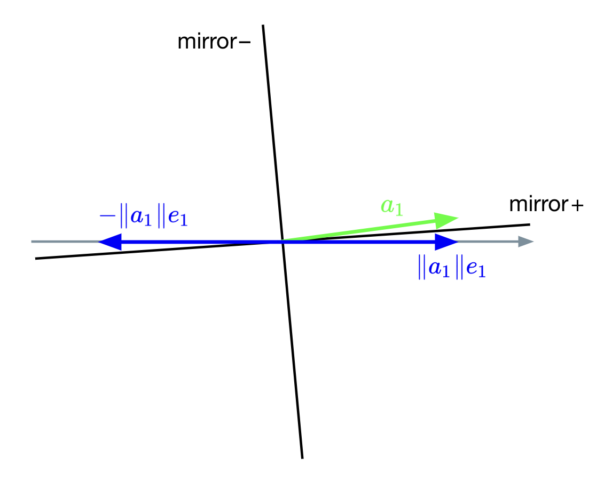

{:toc}

---

A compelling motivation: A natural decomposition for thinking about least 
squares problems ($Ax = b$) is the QR decomposition of $A$,

$$
A = QR,
$$

where $Q$ is an $m \times m$ unitary matrix (recall: $Q^H Q = \mathrm{I}$ for
unitary $Q$) and $R$ is an $m \times n$ upper triangular matrix. For 
tall-thin matrices ($m \geq n$), it is often beneficial to note the _economy_ 
(or, thin [Golub and Van Loan], or, reduced [Trefethen and Bau]) QR 
decomposition as

$$
A = QR = Q \begin{bmatrix}
R_1 \\
0
\end{bmatrix} = \begin{bmatrix} Q_1 & Q_2 \end{bmatrix} \begin{bmatrix}
R_1 \\
0
\end{bmatrix} = Q_1 R_1,
$$

where $R_1$ is an $n \times n$ upper triangular matrix and $0$ is an 
$(m - n) \times n$ zero matrix, $Q_1$ is an $m \times n$ matrix, and $Q_2$ is
$m \times (m - n)$. ($Q_1$ and $Q_2$ have orthogonal columns.)

We can find a solution, $\hat{x}$, to an overdetermined system $Ax = b$ 
($m \geq n$) using the QR decomposition as

$$
\hat{x} = R_1^{-1} (Q_1^H b).
$$

(Note: We don't need to explicitly compute $R_1^{-1}$; instead, we can use
back substitution to find $\hat{x}$.)

<br/>
#### Gram-Schmidt, a brief note

A first course in linear algebra often shows orthogonalization (converting the 
existing basis of $A$ to an orthonormal basis) using the Gram-Schmidt process.
The Gram-Schmidt process orthogonalizes by subtracting off components in the
directions of previous columns and then normalizing the remainder to unit 
length. Simply put,

$$
q_j = (\mathrm{I} - P_{j-1}) a_j,
$$

where $P_{j-1}$ is a projector onto $(q_1, \dotsc, q_{j-1})$.

A critical question to ask here is the following: what happens when $a_j$ is
large and lies really close to $P_{j-1}$—aha!—the computation of $q_j$ as shown
above is prone to catastrophic cancellation. More concretely, the computed $q_j$
might not be orthogonal to previous $q_j$s.

To overcome this issue of catastrophic cancellation, the _modified_ Gram-Schmidt
algorithm is often discussed. However, we will see a different approach of using
Householder reflectors to achieve orthogonal triangularizations.

<br/>
#### QR factorization via Householder reflections

##### Reflecting a vector

Before proceeding with Householder QR, let us look at Householder reflections,
which are to become an essential part of Householder QR. 

Our goal here will be to come up with a linear transformation that reflects a 
given vector, $x$, about a subspace, $\mathcal{V}$. Let $u$ be a vector of unit
length ($\Vert u \Vert_2 = 1$) orthogonal to subspace $\mathcal{V}$. Then, 
$H = (\mathrm{I} - 2 u u^H)$ is the transformation that represents reflecting
$x$ with respect to the subspace orthogonal to the vector $u$ (= "mirror").

<div align="center">
    
</div>

$H$ is often referred to as the Householder transformation or Householder 
reflector.

Some observations to note:
* Any vector $z$ in the subspace $\mathcal{V}$ (= orthogonal to the vector $u$) 
is left unchanged: 

    $$
    Hz = (\mathrm{I} - 2 u u^H) z = z - 2 u (u^H z) = z.
    $$

* Any vector $x$ can be written as $z + (u^H x) u$, where $z$ is the projection
of $x$ onto the subspace $\mathcal{V}$ and $(u^H x) u$ is the projection in the
direction of $u$ (orthogonal to $\mathcal{V}$). Now, the reflection is

    $$
    \begin{align*}
    Hx &= (\mathrm{I} - 2 u u^H)(z + (u^H x) u) \\
    &= z + (u^H x) u - 2 u u^H (u^H x) u \\
    &= z + (u^H x) u - 2 (u^H x) u (\underbrace{u^H u}_{=\,1}) \\
    &= z + (u^H x) u - 2 (u^H x) u \\
    &= z - (u^H x) u.
    \end{align*}
    $$

    If the vector $x$ has a component orthogonal to the mirror ($u^H x \neq 0$), 
then that component is reversed.

* Finally, observe that reflection is a length-preserving transformation. (Note: 
$H^HH = HH^H = I$ and $HH = I$: reflecting a reflection results in the original
vector.)

$$
\Vert Hx \Vert_2^2 = (Hx)^H Hx = x^H (\underbrace{H^H H}_{\mathrm{I}}) x = x^H x 
= \Vert x \Vert_2^2.
$$

##### Adjusting the mirror

Given two vectors, $x$ and $y$, our goal is to find a mirror (= subspace 
$\mathcal{V}$) that facilitates reflecting vector $x$ into vector $y$ with 
$\Vert x \Vert_2 = \Vert y \Vert_2$. Simply put, we need to compute $u$ such
that

$$
\begin{align*}
y = (\mathrm{I} - 2 u u^H) x = x - 2 u u^H x
\implies 2 \underbrace{u u^H x}_{=\,p} = x - y,
\end{align*}
$$

where $p$ is the projection of $x$ onto $u$ (see figure in the previous 
subsection). By construction, $p$ and $u$ must point in the same direction.
Hence, $u$ must be a unit vector in that direction:

$$
u = \frac{x - y}{\Vert x - y \Vert_2}.
$$

Now, we have an approach of determining the vector $u$, which defines a subspace
that mirrors $x$ into $y$.

__Remark.__ If $u$ is not a unit vector, the Householder transformation is 

$$
H = \mathrm{I} - 2 \frac{u u^H}{u^H u}.
$$

##### Householder QR

Our goal is to convert $A$ to an upper triangular matrix through a series of 
orthogonal transformations. Here's a chalkboard animation (as David Bindel would
call it!):

$$
A = \begin{bmatrix} 
    \small{\times} & \small{\times} & \small{\times} \\
    \small{\times} & \small{\times} & \small{\times} \\
    \small{\times} & \small{\times} & \small{\times} \\
    \small{\times} & \small{\times} & \small{\times} \\
    \vdots & \vdots & \vdots \\
    \small{\times} & \small{\times} & \small{\times} \\
\end{bmatrix} \xrightarrow{H_1} \matrix{\begin{bmatrix} 
    \color{green}{*} & \small{*} & \small{*} \\
    \color{green}{0} & \small{*} & \small{*} \\
    \color{green}{0} & \small{*} & \small{*} \\
    \color{green}{0} & \small{*} & \small{*} \\
    \color{green}{\vdots} & \vdots & \vdots \\
    \color{green}{0} & \small{*} & \small{*} \\
\end{bmatrix} \\[1pt] \small{H_1 A}} \xrightarrow{H_2} \matrix{\begin{bmatrix} 
    * & * & * \\
    0 & \color{green}{\star} & \small{\star} \\
    0 & \color{green}{0} & \small{\star} \\
    0 & \color{green}{0} & \small{\star} \\
    \vdots & \color{green}{\vdots} & \vdots \\
    0 & \color{green}{0} & \small{\star} \\
\end{bmatrix} \\[1pt] \small{ H_2 H_1 A}} \xrightarrow{H_3} \matrix{\begin{bmatrix} 
    * & * & * \\
    0 & \star & \star \\
    0 & 0 & \color{green}{\small{\bullet}} \\
    0 & 0 & \color{green}{0} \\
    \vdots & \vdots & \color{green}{\vdots} \\
    0 & 0 & \color{green}{0} \\
\end{bmatrix} \\[1pt] \small{ H_3 H_2 H_1 A}} = \begin{bmatrix}
R_1 \\
0
\end{bmatrix}
$$

Let us look at the first step $H_1A$:

$$
H_1 A = H_1 \begin{bmatrix}
| & | & & | \\
a_1 & a_2 & \dots & a_n
| & | & & | \\
\end{bmatrix} = \begin{bmatrix}
| & | & & | \\
H_1 a_1 & H_1 a_2 & \dots & H_1 a_n
| & | & & | \\
\end{bmatrix},
$$

where $a_j$ is an $n$-dimensional column of $A$. What we essentially require is 
a Householder transformation such that $H_1 a_1 = \beta e_1$ for some constant
$\beta$, $e_1$ is the first standard basis vector. Since Householder reflectors
preserve lengths, we need $\vert \beta \vert = \Vert a_1 \Vert_2$. Hence, we 
need to find a reflector (= mirror) $H$ that reflects $a_1$ onto the $x$-axis:

<div align="center">
    
</div>

Now, we have $v$ as

$$
v = \begin{bmatrix} 
a_{11} \\
a_{21} \\
\vdots \\
a_{m1} \\
\end{bmatrix} - \begin{bmatrix} 
\beta \\
0 \\
\vdots \\
0 \\
\end{bmatrix}.
$$

Notice that we have several options to choose $\beta$: $\Vert a_1 \Vert_2$,
$- \Vert a_1 \Vert_2$, $z \Vert a_1 \Vert_2$ for some $z \in \mathcal{C}$ with 
$\vert z \vert = 1$. If we restrict to real-valued $a_1$, we have

$$
v = a_1 \mp \Vert a_1 \Vert_2 e_1.
$$

If we choose $\beta = -\Vert a_1 \Vert_2$, we are consequently placing the 
mirror as follows:

<div align="center">
    
</div>

For completeness, we have 

$$
H_1 = \mathrm{I} - 2 \frac{u u^H}{u^H u} = \beta e_1.
$$

__Remark on numerical stability.__ Observe that the first element of $v$, 
$v_1 = a_{11} \mp \Vert a_1 \Vert_2$. If $a_{11}$ is positive and 
$a_{11} \approx \Vert a_1 \Vert_2$ ($a_1$ is really close to $x$-axis), we incur
catastrophic cancellation in the computation of $a_{11} - \Vert a_1 \Vert_2$.

<div align="center">
    
</div>

Irrespective of the sign of $a_{11}$, we can avoid catastrophic cancellation by 
choosing $v = a_1 + \text{sign}(a_11) \Vert a_1 \Vert_2 e_1$:

$$
v = \begin{bmatrix} 
a_{11} + \text{sign}(a_11) \Vert a_1 \Vert_2 \\
a_{21} \\
\vdots \\
a_{m1} \\
\end{bmatrix}.
$$

```python
import jaxtyping as jt
import torch

Fl = lambda size: jt.Float[torch.Tensor, size]

def householder_qr():

```