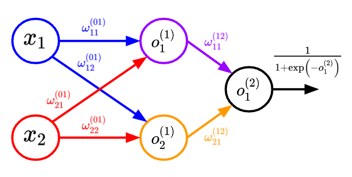

One of the main reasons for the success of *deep* neural networks relies on the underlying initialization strategies. In this post, we'll mostly focus on the Xavier initialization ([Xavier and Bengio, 2010](http://proceedings.mlr.press/v9/glorot10a.html)) and its adaptation, the He or Kaiming initialization ([Kaiming et al., 2015](https://arxiv.org/abs/1502.01852)).

So why is initialization so important? If the weights are updated anyways, with any (random) initialization, wouldn't we eventually end up at the optimal weights? To motivate the problem of neural network initialization, consider a simple case of one hidden layer with two ReLU-activated neurons, and a sigmoid output (assume zero biases).



#### constant initialization

In the above toy network, we have weights $$\omega^{(01)}_{11}, \omega^{(01)}_{12}, \omega^{(01)}_{21}, \omega^{(01)}_{22}$$, where $$\omega^{(KL)}_{ij}$$ denotes the weight on the edge from neuron-$$i$$ in layer-$$K$$ to neuron-$$j$$ in layer-$$L$$. Let's initialize all the weights to some constant $$\kappa$$, i.e., $$\omega^{(01)}_{11} = \omega^{(01)}_{12} = \omega^{(01)}_{21} = \omega^{(01)}_{22} = \kappa$$; notice that the output from the two neurons are as follows ($$o^{(l)}_i$$ indicates the output at layer-$$l$$ and neuron-$$i$$):

$$
\begin{align*}
o^{(1)}_1 &= \text{relu}(\omega^{(01)}_{11} x_1 + \omega^{(01)}_{21} x_2) = \text{relu}(\kappa (x_1 + x_2)) \\
o^{(1)}_2 &= \text{relu}(\omega^{(01)}_{12} x_1 + \omega^{(01)}_{22} x_2) = \text{relu}(\kappa (x_1 + x_2))
\end{align*}
$$

Observe that the outputs $$o^{(1)}_1$$ and $$o^{(1)}_2$$ from both the neurons are exactly the same. The compute graph is as follows:

```

```

Let's build this simple network and inspect the gradients and the resultant weight updates.




```python
```




```python
```




