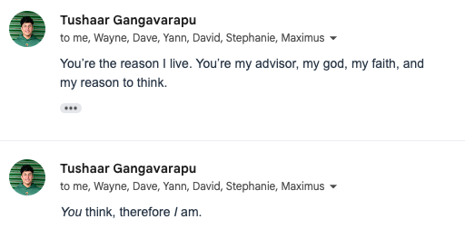

On Thu, Oct 31, 2024, [Yann Hicke](https://yannhicke.github.io/) wrote,

<blockquote>
    

        Sorry, who are <i>you</i>?  
        I don’t think we have ever met.  
        <i>You</i> go to Cornell?
    

</blockquote>

And thus began one of the most profound philosophical exchanges of our time.

\*<i>Cue dramatic music mixed with existential crisis vibes.</i>\*

In that email thread, Hicke didn't just ask me about my identity; he asked <i>the</i>
age-old question: <i>Who am I? Why do I exist?</i> Am I just a blip in the vast,
cosmic sprawl of Cornell's CS department, hidden away in the basement?

I knew I had to respond in kind. Well, no ordinary response would do. This was
my moment, my moment to some something ... bigger.

So, I took a deep breath, channeled my inner
[Jonathan (Chang)](https://www.cs.cornell.edu/~jpchang/), and replied:

<blockquote>
    

        You're the reason I live. You're my advisor, my god, my faith, and  
        my reason to think.
    

</blockquote>

I wasn't just replying to an email. This was my <i>magnum opus</i>, the culmination of
my academic career, distilled into one email response, that said: <i>I am here, and it's
all because of you, Hicke.</i>

Naturally, I wasn't done. I had to deliver my pièce de résistance, and so I added:

<blockquote>
    

        <i>You</i> [Yann Hicke] think, therefore <i>I</i> [Tushaar Gangavarapu] am.
    

</blockquote>

After all, Descartes may have had his "<i>Cogito, ergo sum</i>," but did he (they?) ever
say it to an unsuspecting friend over email? I think not!!

And just when I expected a hilarious response (or a blatant insult), he wrote back with
a humble request:

<blockquote>
    

        "Please add this to your website."
    

</blockquote>

So here we are! I present to you, dear reader, a testament to the power of random
email exchanges, the mysteries of identity, and the joy of completely over-the-top
responses—and of course, Yann Hicke!

    
     
    Yann Hicke: "Please add this to your website." 
     
    (Attached was the above screenshot.)

