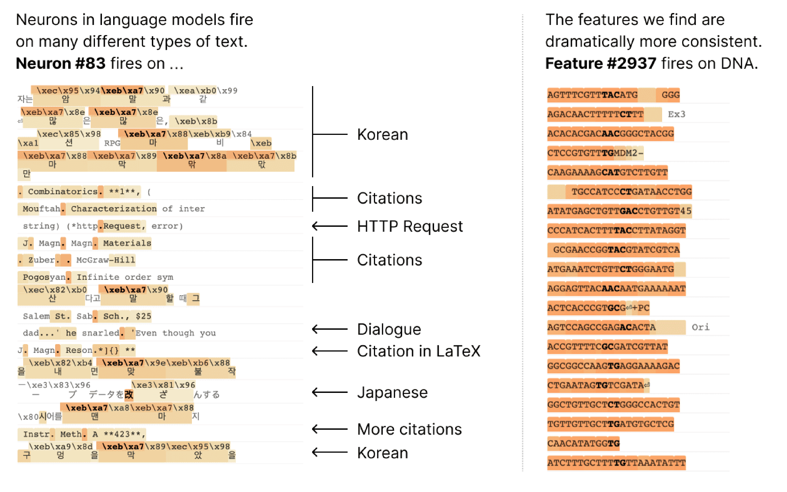

__tl; dr.__ 

## Sparse autoencoders and superposition

To reverse engineer a (trained) neural network, we can break the network down to 
smaller computational units that can be analyzed individually. The most natural 
unit of a neural network is the individual neuron itself. However, neurons are 
often _polysemantic_: they activate for a range of seemingly unrelated concepts. 
For example, [a single neuron](https://transformer-circuits.pub/2023/monosemantic-features/vis/a-neurons.html#feature-83) 
in a small language model is active in several unrelated contexts: citations, 
dialog, Korean text, HTTP requests.

    
 
    (Source: <a href="https://www.alignmentforum.org/posts/TDqvQFks6TWutJEKu/towards-monosemanticity-decomposing-language-models-with">
    Towards monosemanticity: Decomposing language models with dictionary learning</a>.)

 

As can be seen above, polysemanticity makes it difficult to reason about the 
network by simply analyzing neuron activations.

__The superposition hypothesis.__ A potential cause of polysemanticity is
_superposition_: in an intermediate representation of $n$ dimensions, the 
network encodes $m$ ($\gg n$; non-orthogonal) concepts as linear combinations 
of neuron activations. While these $m$ concepts are fixed across all inputs 
based on the training data, for a given input, only a sparse subset of these 
concepts are active. Thus, the simultaneous interference between concepts is 
minimal.

Following the superposition hypothesis, _sparse_ autoencoders (SAEs) have been 
used to find sparse decompositions of model activations in terms of an 
overcomplete basis (= dictionary).

---

## References

[^1]: Olah, C., Mordvintsev, A., Schubert, L., 2017. Feature Visualization. Distill 2, e7. https://doi.org/10.23915/distill.00007