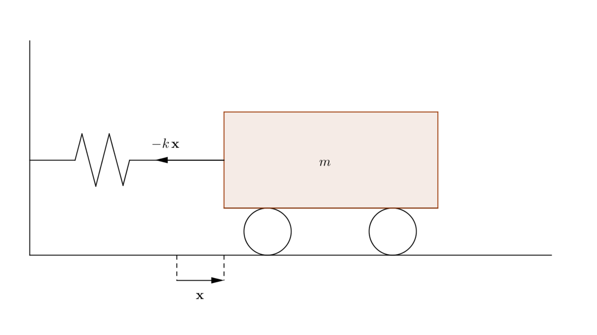

## Preliminaries

<blockquote class="quote_md">

    "<i>The simplest thing that can happen in the physical universe is nothing. The next simplest thing, which doesn't get too far away from nothing, is an oscillation about nothing.</i> [...] <i>When many oscillators are put together, you get waves.</i>" 

 &#151;Matthew Schwartz, <a href="https://scholar.harvard.edu/files/schwartz/files/lecture1-oscillators-and-linearity.pdf">Lecture 1: Simple Harmonic Oscillators</a>

</blockquote>

Before we begin, let's setup a running example of the simple harmonic oscillator: consider the one-dimensional (horizontal) movement of a mass, attached to a wall with a spring as shown below:

Note that the gravitational force doesn't affect the above mass-spring system. Finally, let's assume that the equilibrium position of the mass, say $x$, is at $x = 0$, with positive displacement values corresponding to a stretched string.

### Fourier transform

#### Simple harmonic motion (SHM)

In the above mass-spring system, when the system is displaced from its equilibrium position, the elasticity of the spring would provide a restoring force to restore the mass to equilibrium. From Newton's first law of motion, we know that inertia causes the system to overshoot this equilibrium. This constant play between inertial and elastic properties causes the mass to oscillate.

Assuming no other forces act on the system (external or otherwise (e.g., air resistance)), the spring constant $k$ provides the elastic restoration force $F(x) = -kx$ (following the Hooke's law, which is a first-order Taylor approximation of the restoring force[^1]), while the inertia of mass $m$ provides the overshoot. From Newton's second law of motion, we have $F = m\ddot{x}$, which gives us the following second-order ODE:

$$
-kx = m\ddot{x} \Rightarrow \ddot{x}(t) + \underbrace{\omega_0^2}_{k/m} x(t) = 0
$$

where the dot over a variable ($\dot{x}$) indicates differentiation of the variable ($x$) with respect to time, two dots ($\ddot{x}$) denote the second derivative with respect to time, etc.

From the above ODE, notice that the we want a function $x(t)$ such that its second derivative is proportional to itself, i.e., $\ddot{x}(t) \propto x(t)$; lucky for us!, we know at least two functions with this property–sine and cosine. Let's write out an [ansatz](https://handwaving.github.io/270):

$$
x(t) = a \sin(\omega t) + b \cos(\omega t) \tag{1}
$$

where $a, b \in \mathbb{R}$ are constants, $\omega = 2\pi f$ is the (natural) angular frequency and $f$ is the frequency. Plugging this (conveniently guessed!) function into the ODE gives us:

$$
-\omega^2(A \sin(\omega t) + B \cos(\omega t)) + \omega_0^2 (A \sin(\omega t) + B \cos(\omega t)) = 0 \Rightarrow \omega = \omega_0 = \sqrt{k/m} \tag{2}
$$

Hence, we note that $x(t)$ goes back to itself after $t \rightarrow t + T$, where $T = 1/f = 2\pi / \omega_0$; simply put $x(t) = x(t + nT)$ for any $n \in \mathbb{Z}$. 

In the above expression for $x(t)$ as shown in ($1$), we note that $\omega$ can be computed using ($2$) and depends only on the spring constant $k$ and mass $m$; however, $a$ and $b$ are not fixed. To determine a particular solution to ($1$), we need to impose two initial conditions (to compute the two unknowns, $a$ and $b$). For instance, if the initial position $x(0)$ and initial velocity $\dot{x}(0)$ are known, then:

$$
\begin{align}
\dot{x}(t) = a\omega_0 \cos(\omega_0 t) - b\omega_0 \sin(\omega_0 t) &\Rightarrow \dot{x}(0) = a\omega_0 \equiv a = \frac{\dot{x}(0)}{\omega_0} \\
x(t) = a \sin(\omega_0 t) + b \cos(\omega_0 t) &\Rightarrow x(0) = b
\end{align}
$$

Hence, we have:

$$
x(t) = \frac{\dot{x}(0)}{\omega_0}\sin(\omega_0 t) + x(0) \cos(\omega_0 t)
$$

#### Using Fourier transform to model SHM

### Laplace transform

---

## State-space models

---

[^1]: Let's say that we displace a system, a distance $x$ from the equilibrium position ($x = 0$) and measure the restoring force as a function $F(x)$. By definition, $F(0) = 0$, i.e., no restoring force at equilibrium. Now, using [Taylor's remainder theorem](https://people.clas.ufl.edu/kees/files/TaylorRemainderProof.pdf), we have: $F(x) = F(0) + xF'(0) + \frac{F''(\xi)}{2} x^2$ where, $0 \leq \xi \leq x$. For really small displacements, we can ignore higher-order terms, and therefore, $F(x) = -kx$ with $k = -F'(0)$. Note that systems obeying Hook's law are linear, i.e., close to equilibrium ($x$ is sufficiently small!).
