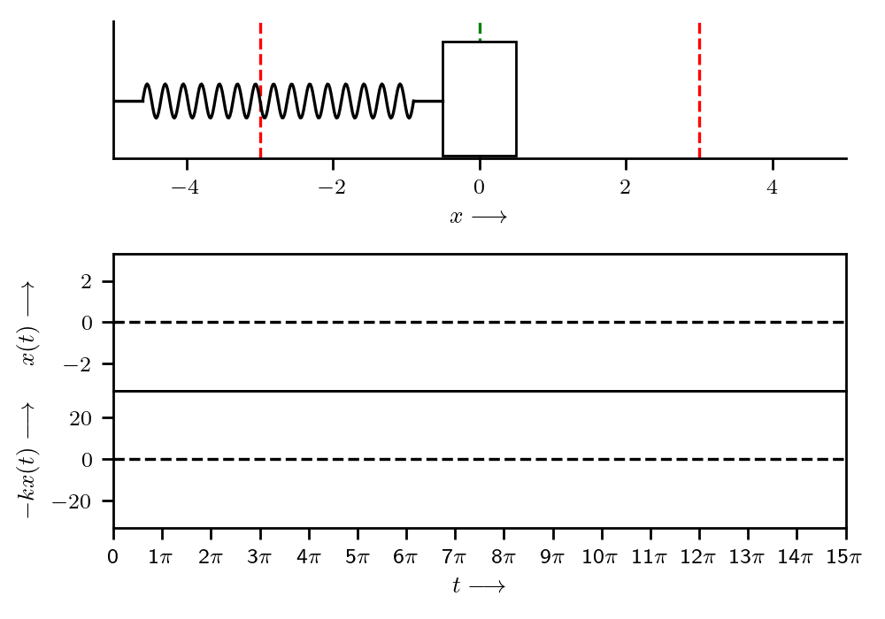

## Preliminaries

<blockquote class="quote_md"><div>
    "<i>The simplest thing that can happen in the physical universe is nothing. The next simplest thing, which doesn't get too far away from nothing, is an oscillation about nothing.</i> [...] <i>When many oscillators are put together, you get waves.</i>" <p style="margin-bottom:0.1cm;"></p> &#151;Matthew Schwartz, <a href="https://scholar.harvard.edu/files/schwartz/files/lecture1-oscillators-and-linearity.pdf">Lecture 1: Simple Harmonic Oscillators</a>
</div></blockquote>

Before we begin, let's setup a running example of the simple harmonic oscillator: consider the one-dimensional (horizontal) movement of a mass, attached to a wall with a spring as shown below:


Note that the gravitational force doesn't affect the above mass-spring system. Finally, let's assume that the equilibrium position of the mass, say $x$, is at $x = 0$, with positive displacement values corresponding to a stretched string.

### Simple harmonic motion (SHM)

In the above mass-spring system, when the system is displaced from its equilibrium position, the elasticity of the spring would provide a restoring force to restore the mass to equilibrium. From Newton's first law of motion, we know that inertia causes the system to overshoot this equilibrium. This constant play between inertial and elastic properties causes the mass to oscillate.

Assuming no other forces act on the system (external or otherwise (e.g., air resistance, friction, etc.)), the spring constant $k$ provides the elastic restoration force $F(x) = -kx$ (following the Hooke's law, which is a first-order Taylor approximation of the restoring force[^1]), while the inertia of mass $m$ provides the overshoot. From Newton's second law of motion, we have $F = m\ddot{x}$, which gives us the following second-order ordinary differential equation (ODE):

$$
-kx = m\ddot{x} \Rightarrow \ddot{x}(t) + \underbrace{\omega_0^2}_{k/m} x(t) = 0
$$

where the dot over a variable ($\dot{x}$) indicates differentiation of the variable ($x$) with respect to time, two dots ($\ddot{x}$) denote the second derivative with respect to time, etc.

From the above ODE, notice that the we want a function $x(t)$ such that its second derivative is proportional to itself, i.e., $\ddot{x}(t) \propto x(t)$; lucky for us!, we know at least two functions with this property–sine and cosine. Let's write out an [ansatz](https://handwaving.github.io/270):

$$
x(t) = a \sin(\omega t) + b \cos(\omega t) \tag{1}
$$

where $a, b \in \mathbb{R}$ are constants, $\omega = 2\pi f$ is the (natural) angular frequency and $f$ is the frequency. Plugging this (conveniently guessed!) function into the ODE gives us:

$$
-\omega^2(A \sin(\omega t) + B \cos(\omega t)) + \omega_0^2 (A \sin(\omega t) + B \cos(\omega t)) = 0 \Rightarrow \omega = \omega_0 = \sqrt{k/m} \tag{2}
$$

Hence, we note that $x(t)$ goes back to itself after $t \rightarrow t + T$, where $T = 1/f = 2\pi / \omega_0$; simply put $x(t) = x(t + nT)$ for any $n \in \mathbb{Z}$. 

In the above expression for $x(t)$ as shown in ($1$), we note that $\omega$ can be computed using ($2$) and depends only on the spring constant $k$ and mass $m$; however, $a$ and $b$ are not fixed. To determine a particular solution to ($1$), we need to impose two initial conditions (to compute the two unknowns, $a$ and $b$). For instance, if the initial position $x(0)$ and initial velocity $\dot{x}(0)$ are known, then:

$$
\begin{align}
\dot{x}(t) = a\omega_0 \cos(\omega_0 t) - b\omega_0 \sin(\omega_0 t) &\Rightarrow \dot{x}(0) = a\omega_0 \equiv a = \frac{\dot{x}(0)}{\omega_0} \\
x(t) = a \sin(\omega_0 t) + b \cos(\omega_0 t) &\Rightarrow x(0) = b
\end{align}
$$

Hence, we have:

$$
x(t) = \frac{\dot{x}(0)}{\omega_0}\sin(\omega_0 t) + x(0) \cos(\omega_0 t)
$$

Let's graph the general solution to the SHM ODE shown in ($1$):

```python
import matplotlib.patches as patches
import matplotlib.pyplot as plt
import numpy as np
from celluloid import Camera

plt.rcParams.update({"font.size": 8})
plt.rcParams["text.usetex"] = True


k = 10  # spring constant
m = 90  # mass


def x(t, x0=0, v0=1):
    """Compute x(t) at a given t; parameterized by x(0) and x'(0)."""
    w0 = np.sqrt(k / m)
    return ((v0 / w0) * np.sin(w0 * t)) + (x0 * np.cos(w0 * t))


# Setup fig, axes for animation.
gridspec = dict(hspace=0.0, height_ratios=[1, 0.7, 1, 1])
fig, (ax1, ax2, ax3, ax4) = plt.subplots(nrows=4, figsize=(5, 3.5), gridspec_kw=gridspec)
ax2.set_visible(False)
camera = Camera(fig)
ax1.set(xlabel=r"$x \longrightarrow$")
ax1.set(xlim=(-5, 5), ylim=(-0.5, 0.7))
ax1.spines["right"].set_visible(False)
ax1.spines["top"].set_visible(False)
ax3.set(ylabel=r"$x(t) \longrightarrow$", xticks=[], yticks=[-2, 0, 2], xlim=(0, 15 * np.pi))
ax3.yaxis.set_label_coords(-0.1, 0.5)
ax4.set(
    xlabel=r"$t \longrightarrow$",
    ylabel=r"$-kx(t) \longrightarrow$",
    yticks=[-20, 0, 20],
    xlim=(0, 15 * np.pi),
    xticks=np.arange(0, 16 * np.pi, np.pi),
    xticklabels=([0] + [f"{n}$\pi$" for n in range(1, 16)]),
)
ax4.yaxis.set_label_coords(-0.1, 0.5)

t_vals = np.linspace(0, 15 * np.pi, 100)  # timesteps
x_vals = x(t_vals)  # displacement: x(t)
f_vals = -k * x_vals  # restoring force: -kx(t)
for t in range(0, len(t_vals), 1):
    # Spring: https://stackoverflow.com/a/65481246.
    spring_x = np.linspace(-4.6, x_vals[t] - 0.4 - 0.5, 240)
    spring_y = 0.15 * np.sin((spring_x + 4.6) * (2 * np.pi) * 15 / (x_vals[t] + 4.6 - 0.4 - 0.5))
    mass = patches.Rectangle((x_vals[t] - 0.5, -0.48), 1, 1, lw=1, edgecolor="black", facecolor="white")
    ax1.plot([-5, -4.6], [0, 0], color="black")
    ax1.plot([x_vals[t] - 0.4 - 0.5, x_vals[t] - 0.5], [0, 0], color="black")
    ax1.plot(spring_x, spring_y, color="black")
    ax1.axvline(x=0.0, color="green", linestyle="dashed", zorder=-1)
    ax1.axvline(x=-3.0, color="red", linestyle="dashed", zorder=-1)
    ax1.axvline(x=3.0, color="red", linestyle="dashed", zorder=-1)
    ax1.add_patch(mass)
    ax1.set(yticks=[])
    if x_vals[t] < 0:
        ax1.text(0.03, 1, r"$\leftarrow m\ddot{x}(t)$", ha='left', va='top', transform=ax1.transAxes)
        ax1.text(0.03, 0.8, r"$kx(t) \rightarrow$", ha='left', va='top', transform=ax1.transAxes)
    elif x_vals[t] > 0:
        ax1.text(0.03, 1, r"$m\ddot{x}(t) \rightarrow$", ha='left', va='top', transform=ax1.transAxes)
        ax1.text(0.03, 0.8, r"$\leftarrow kx(t)$", ha='left', va='top', transform=ax1.transAxes)
    # Plot displacement and restoring force.
    ax3.plot(t_vals[:t], x_vals[:t], color="orange")
    ax3.axhline(y=0.0, color="black", linestyle="dashed", zorder=-1)
    ax4.plot(t_vals[:t], f_vals[:t], color="blue")
    ax4.axhline(y=0.0, color="black", linestyle="dashed", zorder=-1)
    camera.snap()
plt.tight_layout()
animation = camera.animate()
animation.save("imgs/simple-harmonic-motion.gif", dpi=200, writer="imagemagick")
```



Notice the wavelike pattern $x(t)$ with a frequency $1/6\pi$ followed by the mass. Hence, a simple harmonic oscillator follows a (sinusoidal) wavelike pattern in the absence any other forces, external or otherwise.

#### Sines, cosines, and exponentials

Before proceeding, let's recall the Euler's identity: $\exp(j\omega t) = \cos(\omega t) + j \sin(\omega t)$, and note that:

$$
\cos(\omega t) = \frac{\exp(j\omega t) + \exp(-j \omega t)}{2};\qquad \sin(\omega t) = \frac{\exp(j \omega t) - \exp(-j \omega t)}{2j} \tag{3}
$$

The SHM ODE in ($1$) indicates that $\ddot{x}(t) \propto x(t)$; we noted in the previous section that sines and cosines satisfy the property of the second (or even numbers of) derivatives being proportional to themselves, i.e.,

$$
\frac{d^2}{dt^2}a\sin(\omega t) = -a\omega^2 \sin(\omega t); \qquad \frac{d^2}{dt^2}b\cos(\omega t) = -b\omega^2 \cos(\omega t)
$$

Apart from sines and cosines, the exponential function has all its derivatives proportional to itself:

$$
\frac{d}{dt} c\exp(\omega t) = c\omega\exp(\omega t); \qquad \frac{d^2}{dt^2} c\exp(\omega t) = c\omega^2 \exp(\omega t)
$$

Let's try this ansatz, i.e., $x(t) = c\exp(\omega t)$, into our SHM ODE in ($1$):

$$
\begin{align*}
\ddot{x}(t) + \omega_0^2 x(t) &= 0 \\
c\omega^2\exp(\omega t) + c \omega_0^2 \exp(\omega t) &= 0 \tag{4}
\end{align*}
$$

In ($4$), since $\exp(\omega t) > 0$, this implies that $\omega^2 = -\omega_0^2$ or $\omega = \pm\sqrt{-1} \omega_0 = \pm j \omega_0$. Noting that if $c\exp(j\omega_0t)$ and $c\exp(-j\omega_0 t)$ are two (distinct) solutions of ($1$), then the general solution[^2] to ($1$) is given as:

$$
x(t) = c_1 \exp(j \omega_0 t) + c_2 \exp(-j \omega_0 t)
$$

Using ($3$) and ($4$), we get:

$$
x(t) = j(c_1 - c_2)\sin(\omega_0 t) + (c_1 + c_2) \cos(\omega_0 t)
$$

### Damped oscillator

In the previous section on SHM, our mass on a spring system did not account for any damping (e.g., air resistance, friction, etc.). A damped oscillator dissipates its energy, eventually returning to the equilibrium position (unlike in SHM). The damping force must vanish when the body is at rest, and for small velocities[^3], the damping force must be proportional to the velocity: $F \propto -b \dot{x}$ for some damping constant $b$. Thus, the generic form for damped oscillation *close to equilibrium* is:

$$
m\ddot{x} = -k x - b \dot{x} \equiv \ddot{x} + \underbrace{\gamma}_{b/m} \dot{x} + \underbrace{\omega_0^2}_{k/m} x = 0 \tag{5}
$$

Just as an aside, ($5$) describes the motion of various physical systems: sound waves, vibrating strings, etc. It can be easily verified that unlike in the case of SHM, $\sin(\omega t)$ or $\cos(\omega t)$ solve the damped oscillator ODE, since $\sin$ and $\cos$ are proportional to their second derivatives, while ($5$) includes a first derivative term as well. However, as noted in the previous section, exponentials are proportional to all their derivatives, including the first and the second. So, let's try plugging in $x(t) = c\exp(\omega t)$ in ($5$):

$$
\begin{align*}
c\omega^2 \exp(\omega t) + c\gamma \omega \exp(\omega t) + c \omega_0^2 \exp(\omega t) = 0 \\
\omega^2 + \gamma \omega + \omega_0^2 = 0 \\
\Rightarrow \omega = \frac{-\gamma}{2} \pm \sqrt{\left(\frac{\gamma}{2}\right)^2 - \omega_0^2}
\end{align*}
$$

Hence, the general solution to the damped oscillator ODE is:

$$
\begin{align*}
x(t) &= c_1 \exp\left(t\frac{-\gamma}{2} + t\sqrt{\left(\frac{\gamma}{2}\right)^2 - \omega_0^2}\right) + c_2 \exp\left(t\frac{-\gamma}{2} - t\sqrt{\left(\frac{\gamma}{2}\right)^2 - \omega_0^2}\right) \\
x(t) &= \exp\left(\frac{-\gamma}{2}t\right) \left[c_1 \exp\left(t\sqrt{\left(\frac{\gamma}{2}\right)^2 - \omega_0^2}\right) + c_2 \exp\left(-t\sqrt{\left(\frac{\gamma}{2}\right)^2 - \omega_0^2}\right)\right]
\end{align*}
$$

The cases of $\gamma < 2\omega_0$ (underdamping), $\gamma = 2\omega_0$ (critical damping), and $\gamma > 2\omega_0$ (overdamping) demonstrate varied physical behavior.

#### Underdamping: $\gamma < 2\omega_0$

Note that $\gamma = 0$ also falls under the case of underdamping, and when $\gamma = 0$, the damping force vanishes and we must regain the original SHM. Given that $\gamma < 2\omega_0$, let:

$$
w_u = \sqrt{\omega_0^2 - \left(\frac{\gamma}{2}\right)^2} \in \mathbb{R}
$$

Now, the general solution ($5$) can rewritten as:

$$
x(t) = \exp\left(\frac{-\gamma}{2}t\right) \left(c_1 \exp(j w_u t) + c_2 \exp(-j w_u t)\right)
$$

#### Overdamping: $\gamma > 2\omega_0$

#### Critical damping: $\gamma = 2\omega_0$

Let's revisit our previous example to understand how the system behaves under different damping conditions:

```python

```

---

## State-space models

---

[^1]: Let's say that we displace a system, a distance $x$ from the equilibrium position ($x = 0$) and measure the restoring force as a function $F(x)$. By definition, $F(0) = 0$, i.e., no restoring force at equilibrium. Now, using [Taylor's remainder theorem](https://people.clas.ufl.edu/kees/files/TaylorRemainderProof.pdf), we have: $F(x) = F(0) + xF'(0) + \frac{F''(\xi)}{2} x^2$ where, $0 \leq \xi \leq x$. For really small displacements, we can ignore higher-order terms, and therefore, $F(x) = -kx$ with $k = -F'(0)$. Note that systems obeying Hook's law are linear, i.e., when mass is close to the equilibrium position ($x$ is sufficiently small!).

[^2]: See Theorem 1 (Recipe for Constant Equations): https://www.math.utah.edu/~gustafso/2250second-order-de-manuscript.pdf.

[^3]: The underlying assumption under which Taylor's first-order approximation holds.
